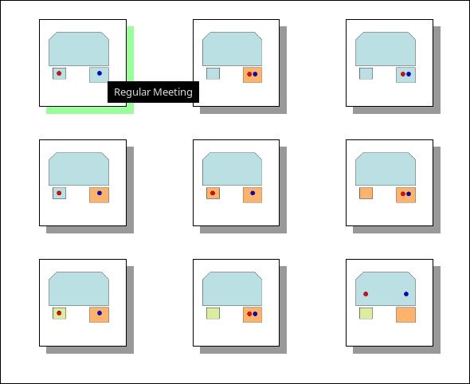

# hedgcoxekhav
Python Flask Service Interface for AV Scene Switching

Simple webinterface frontend to AVMatrix SDI router and Behringer X18R audio mixer.

You can edit the application settings and available scenes in the `config.json` file.

OSC commands and scene settings to the Behringer X18R audio mixer are handled through the utilies found here:

The original source code for the utilities is found here:

A Docker file is included which can build a container image. The `/var/lib/hedgcoxekhav/static` directory should be volume mounted to a local directory to maintain the screnes and web layout from the local file system.

